# Documentación
## a) Componentes y funcionamiento de los servicios del servidor
- Docker: ejecuta un contenedor aislado con WildFly dentro.
- WildFly: servidor de aplicaciones Jakarta EE. Lleva Undertow como servidor web embebido y RESTEasy como implementación de JAX-RS.
- crud-file.war: mi aplicación empaquetada como WAR. Contiene la API REST y una interfaz web básica.
- Puerto 8080: por donde se accede a la aplicación desde el navegador o con curl.
- Puerto 9990: consola de administración de WildFly.
- Endpoint REST: `/crud-file/api/tasks`, donde se hacen las operaciones CRUD.
- Nginx (planteado en los apartados c) e i): servidor web frontal que actúa como reverse proxy delante de WildFly.

El flujo de una petición es el siguiente:

1. El cliente hace una petición HTTP a `localhost:8080/crud-file/api/tasks`.
2. Docker redirige el puerto 8080 del host al 8080 del contenedor.
3. Undertow (dentro de WildFly) recibe la petición.
4. RESTEasy la enruta al método correspondiente de `TaskResource` según las anotaciones `@ApplicationPath("/api")` y `@Path("/tasks")`.
5. El método procesa la petición, accede a `FileTaskStore` para leer/escribir datos, y devuelve la respuesta en JSON.

### Evidencias
Contenedor levantado con los puertos 8080 y 9990 publicados:
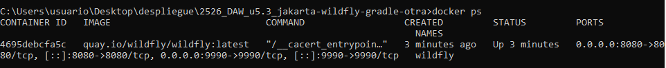

Logs de WildFly mostrando que el WAR se ha desplegado:

Respuesta del endpoint con curl:
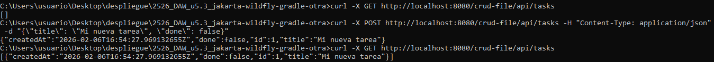

## b) Archivos de configuración y bibliotecas compartidas
El archivo de configuración principal de WildFly en modo standalone es `standalone.xml`, y está en `/opt/jboss/wildfly/standalone/configuration/`. Ahí se pueden tocar cosas como los puertos, los datasources, el nivel de logging o los subsistemas habilitados. También hay otros archivos como `standalone-full.xml` y `logging.properties`.
Para ver el contenido de esa carpeta:
docker exec -it wildfly ls /opt/jboss/wildfly/standalone/configuration/
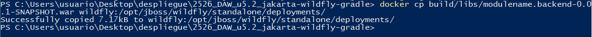
Respecto a las dependencias, en mi `build.gradle` tengo:
dependencies {
    compileOnly 'jakarta.platform:jakarta.jakartaee-api:10.0.0'
}

El `compileOnly` significa que esa dependencia solo se usa para compilar, pero no se mete dentro del WAR. WildFly ya trae su propia implementación de Jakarta EE 10, así que no hace falta incluirla. Gracias a esto el WAR pesa muy poco (unos 15KB) y no hay conflictos de versiones con las librerías del servidor.

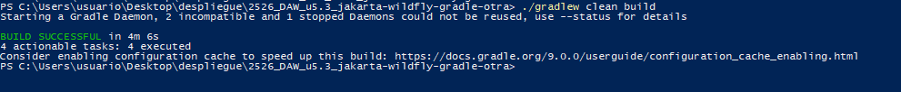

## c) Cooperación con el servidor web (proxy / reverse proxy) y HTTPS
En la P5.2 accedo directamente a WildFly por `localhost:8080`. En un entorno real lo normal sería poner Nginx delante haciendo de reverse proxy. Con eso consigo:
- Publicar la API bajo `/api/` sin que se vea el contexto del WAR.
- No exponer el puerto 9990 hacia fuera.
- Centralizar HTTPS en Nginx sin tocar WildFly.

### Configuración de reverse proxy
upstream wildfly_backend {
    server wildfly:8080;
}

server {
    listen 80;
    server_name localhost;
    return 301 https://$host$request_uri;
}

server {
    listen 443 ssl http2;
    server_name localhost;

    ssl_certificate /etc/nginx/ssl/fullchain.pem;
    ssl_certificate_key /etc/nginx/ssl/privkey.pem;
    ssl_protocols TLSv1.2 TLSv1.3;

    location /api/ {
        proxy_pass http://wildfly_backend/crud-file/api/;
        proxy_set_header Host $host;
        proxy_set_header X-Real-IP $remote_addr;
        proxy_set_header X-Forwarded-For $proxy_add_x_forwarded_for;
        proxy_set_header X-Forwarded-Proto $scheme;
    }

    location / {
        proxy_pass http://wildfly_backend/crud-file/;
        proxy_set_header Host $host;
    }
}

### Qué cambia respecto a mi despliegue actual
Solo se publican los puertos 80 y 443 de Nginx. WildFly queda en una red interna de Docker sin exponer ni el 8080 ni el 9990 al host. El cliente accedería a `https://localhost/api/tasks` en vez de `http://localhost:8080/crud-file/api/tasks`.

### TLS
Para desarrollo he generado certificados autofirmados:
openssl req -x509 -nodes -days 365 -newkey rsa:2048 -keyout privkey.pem -out fullchain.pem -subj "/CN=localhost"

En producción se usaría Let's Encrypt o similar.

Las ventajas de HTTPS son el cifrado de datos en tránsito, la integridad de la comunicación, la autenticación del servidor mediante el certificado, y que permite usar HTTP/2.

No hace falta cambiar nada en WildFly ni en la aplicación porque la terminación SSL se hace en Nginx. WildFly sigue sirviendo HTTP internamente.

## d) Mecanismos de seguridad del servidor de aplicaciones
### Medidas que apliqué en la P5.2
- Creé un usuario de administración con `add-user.sh` para la consola del 9990.
- El contenedor Docker ya proporciona aislamiento respecto al host.

### Medidas que añadiría para producción
**1. No exponer el puerto 9990.** En el docker-compose solo se publica el 80/443 de Nginx. Si necesito la consola, uso un túnel SSH:
ssh -L 9990:localhost:9990 usuario@servidor
**2. Gestión de secretos.** Las credenciales no se hardcodean, van en un `.env` que no se sube a Git:
ADMIN_USER=Fran
ADMIN_PASS=Fjrg1303
Y se añade `.env` al `.gitignore`.
**3. Logs persistentes.** Montar un volumen para no perder los logs al reiniciar:
volumes:
  - ./logs:/opt/jboss/wildfly/standalone/log
**4. Limitación de recursos y reinicio automático.** Evitar que el contenedor consuma todo y que se quede caído:
deploy:
  resources:
    limits:
      cpus: '2'
      memory: 1G
restart: unless-stopped

### Evidencias
Puertos expuestos (se ve el 8080 y 9990 publicados):

La consola del 9990 es accesible desde fuera (responde HTTP 405):
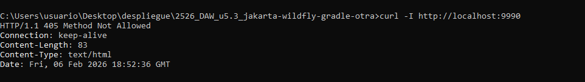

En producción esto no pasaría; con el docker-compose del apartado i) el 9990 no se publica.

## e) Componentes web del servidor de aplicaciones
El WAR es un ZIP con la estructura estándar de una aplicación web Java. El mío contiene las clases compiladas en `WEB-INF/classes/`, el descriptor `WEB-INF/web.xml`, las dependencias en `WEB-INF/lib/` (vacío porque uso `compileOnly`) y el `index.html` de la interfaz web.
El **contexto** lo determina el nombre del WAR: `crud-file.war` se despliega bajo `/crud-file`.
El componente de WildFly que sirve la API es **Undertow**, su servidor web embebido. Recibe las peticiones HTTP y las pasa a RESTEasy (implementación JAX-RS) que las enruta a los métodos de `TaskResource`.

### Cómo funciona la URL
Si miramos por ejemplo `http://localhost:8080/crud-file/api/tasks/1`:
- localhost:8080 es donde está WildFly
- crud-file es el nombre del WAR (define el contexto)
- /api viene de @ApplicationPath en TasksApplication.java
- /tasks viene de @Path en TaskResource.java
- /1 es el id de la tarea

### Evidencias
URLs probadas con curl y navegador:
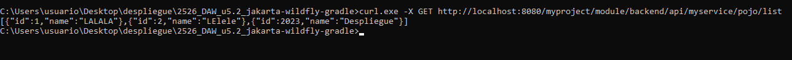

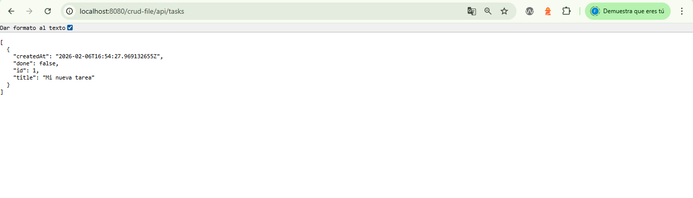

Logs filtrados por crud-file:
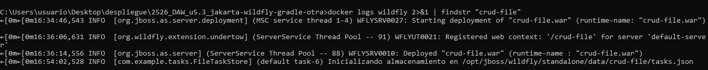

## f) Parámetros necesarios para el despliegue
Para desplegar la aplicación necesito:

- `--name wildfly`: le pongo nombre al contenedor para poder referenciarlo después
- `-p 8080:8080`: publico el puerto HTTP para poder acceder a la app desde el navegador
- `-p 9990:9990`: publico el puerto de admin para poder entrar a la consola de gestión
- `-d`: hago que corra en segundo plano
- Imagen `quay.io/wildfly/wildfly:latest`: la imagen oficial de WildFly
- El nombre del WAR `crud-file.war`: importante porque define el contexto de la URL
- La ruta de despliegue `/opt/jboss/wildfly/standalone/deployments/`: donde WildFly busca los WAR para desplegarlos

Comandos:
docker run -d --name wildfly -p 8080:8080 -p 9990:9990 quay.io/wildfly/wildfly:latest
gradlew war
docker cp build/libs/crud-file.war wildfly:/opt/jboss/wildfly/standalone/deployments/

### Qué pasa si algo está mal
- Puerto ocupado: `port is already allocated`.
- Nombre duplicado: `name is already in use`.
- WAR en ruta incorrecta: no se despliega, da 404.
- Nombre WAR distinto: el contexto cambia y las URLs fallan.

## g) Pruebas de funcionamiento y rendimiento
### Pruebas funcionales
Probé los 4 métodos del CRUD con curl:

curl -s http://localhost:8080/crud-file/api/tasks

curl -s -X POST http://localhost:8080/crud-file/api/tasks -H "Content-Type: application/json" -d "{\"title\": \"Tarea de prueba\", \"done\": false}"

curl -s http://localhost:8080/crud-file/api/tasks/1

curl -s -X PUT http://localhost:8080/crud-file/api/tasks/1 -H "Content-Type: application/json" -d "{\"title\": \"Tarea actualizada\", \"done\": true}"

curl -s -X DELETE http://localhost:8080/crud-file/api/tasks/1

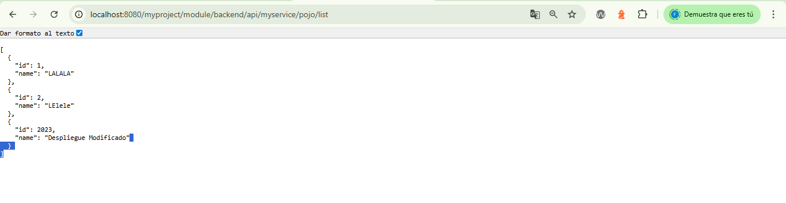
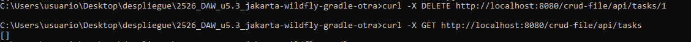

### Prueba de rendimiento
Usé `hey` para lanzar 1000 peticiones con 10 concurrentes:

hey -n 1000 -c 10 http://localhost:8080/crud-file/api/tasks

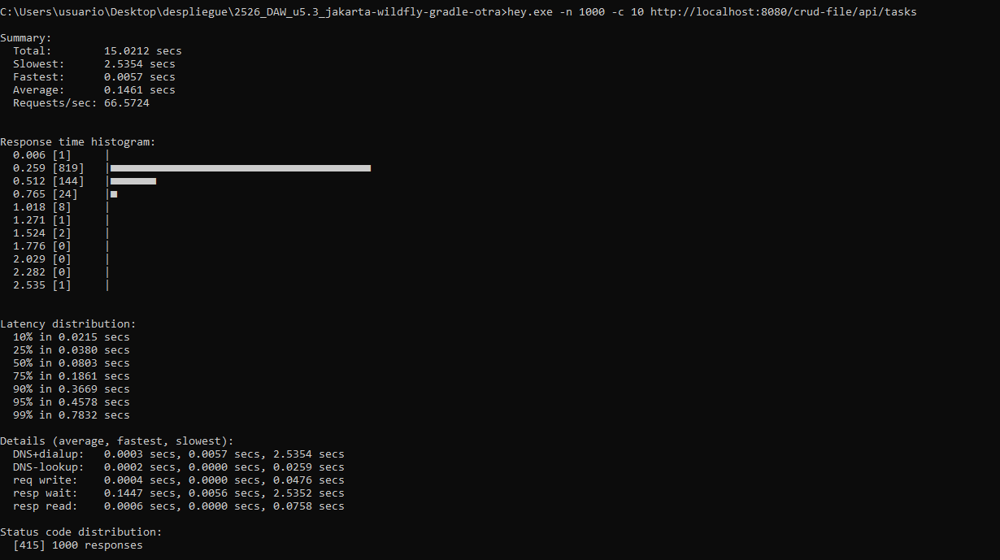

De la salida me fijo en las Requests/sec (cuántas aguanta por segundo), la latencia media, y la distribución de códigos de estado (todo `[200]` significa que no ha habido errores).

Logs de WildFly durante la prueba de rendimiento:

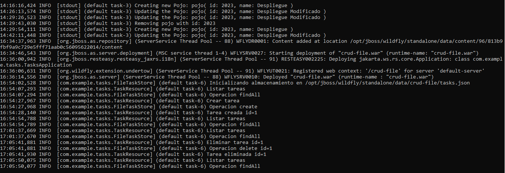

## h) Documentación de administración y recomendaciones
### Levantar WildFly
Lo arrancamos por primera vez:
docker pull quay.io/wildfly/wildfly:latest
docker run -d --name wildfly -p 8080:8080 -p 9990:9990 quay.io/wildfly/wildfly:latest

### Comprobamos que está corriendo:
docker ps

### Crear usuario admin
docker exec -it wildfly /opt/jboss/wildfly/bin/add-user.sh
Elegir `Management User`, meter usuario y contraseña, y reiniciar con `docker restart wildfly`.

### Compilar y desplegar
gradlew war
docker cp build/libs/crud-file.war wildfly:/opt/jboss/wildfly/standalone/deployments/

### Comprobar que funciona
Ver los logs
docker logs -f wildfly

### Probar el endpoint:
curl http://localhost:8080/crud-file/api/tasks

Navegador: `http://localhost:8080/crud-file/`

### Actualizar a nueva versión
gradlew clean war
docker cp build/libs/crud-file.war wildfly:/opt/jboss/wildfly/standalone/deployments/
WildFly detecta el cambio y redespliega solo.

### Comandos útiles
Algunos comandos que uso habitualmente:

- Ver logs en tiempo real: `docker logs -f wildfly`
- Parar el contenedor: `docker stop wildfly`
- Arrancarlo: `docker start wildfly`
- Reiniciarlo: `docker restart wildfly`
- Entrar dentro del contenedor: `docker exec -it wildfly bash`
- Ver los WARs desplegados: `docker exec wildfly ls /opt/jboss/wildfly/standalone/deployments/`

### Errores comunes
- `port is already allocated`: hay algo ya usando ese puerto, hay que pararlo primero
- Error 404: el WAR no se ha desplegado bien, toca revisar si se ha copiado y mirar los logs
- `Connection refused`: el contenedor está parado, hay que arrancarlo con `docker start wildfly`

### URLs de prueba
GET    http://localhost:8080/crud-file/api/tasks
GET    http://localhost:8080/crud-file/api/tasks/{id}
POST   http://localhost:8080/crud-file/api/tasks
PUT    http://localhost:8080/crud-file/api/tasks/{id}
DELETE http://localhost:8080/crud-file/api/tasks/{id}

### Recomendaciones de seguridad
- No dejar el 9990 expuesto en producción.
- Usar `.env` para credenciales y añadirlo a `.gitignore`.
- Montar volúmenes para los logs.
- Usar healthchecks y `restart: unless-stopped`.

### Ficheros Docker
El `docker-compose.yml` y el `nginx.conf` completos están en el apartado i).

## i) Docker Compose: Nginx + WildFly
He montado un docker-compose que junta Nginx (reverse proxy con HTTPS) y WildFly (con la app). El backend no se expone al host, solo Nginx.

### Cómo está montado
Básicamente tengo dos contenedores:

- Nginx en el frontal: recibe las peticiones HTTP (puerto 80) y HTTPS (puerto 443), hace de reverse proxy y se encarga del TLS
- WildFly detrás: sirve la aplicación en el puerto 8080 pero solo internamente, no se expone al host

Están conectados por una red interna de Docker. El cliente solo ve Nginx, WildFly queda protegido detrás.

### docker-compose.yml
version: '3.8'

services:
  nginx:
    image: nginx:alpine
    container_name: nginx-proxy
    ports:
      - "80:80"
      - "443:443"
    volumes:
      - ./nginx/nginx.conf:/etc/nginx/nginx.conf:ro
      - ./nginx/ssl:/etc/nginx/ssl:ro
      - ./logs/nginx:/var/log/nginx
    depends_on:
      wildfly:
        condition: service_healthy
    networks:
      - frontend
    restart: unless-stopped
    healthcheck:
      test: ["CMD", "curl", "-f", "http://localhost/health"]
      interval: 30s
      timeout: 10s
      retries: 3

  wildfly:
    image: quay.io/wildfly/wildfly:latest
    container_name: wildfly-app
    expose:
      - "8080"
    volumes:
      - ./wildfly/deployments:/opt/jboss/wildfly/standalone/deployments
      - ./logs/wildfly:/opt/jboss/wildfly/standalone/log
      - wildfly-data:/opt/jboss/wildfly/standalone/data
    environment:
      - JAVA_OPTS=-Xms256m -Xmx512m -XX:MetaspaceSize=96M -XX:MaxMetaspaceSize=256m
    networks:
      - frontend
      - backend
    restart: unless-stopped
    healthcheck:
      test: ["CMD", "curl", "-f", "http://localhost:8080/crud-file/api/tasks"]
      interval: 30s
      timeout: 10s
      retries: 5
      start_period: 60s
    deploy:
      resources:
        limits:
          cpus: '2'
          memory: 1G
        reservations:
          cpus: '0.5'
          memory: 512M

networks:
  frontend:
    driver: bridge
  backend:
    driver: bridge
    internal: true

volumes:
  wildfly-data:
    driver: local

### nginx.conf
events {
    worker_connections 1024;
}

http {
    include       /etc/nginx/mime.types;
    default_type  application/octet-stream;
    sendfile on;
    keepalive_timeout 65;
    gzip on;
    gzip_types text/plain application/json application/javascript text/css;

    upstream wildfly {
        server wildfly-app:8080;
    }

    server {
        listen 80;
        server_name localhost;

        location /health {
            access_log off;
            return 200 "OK\n";
            add_header Content-Type text/plain;
        }

        location / {
            return 301 https://$host$request_uri;
        }
    }

    server {
        listen 443 ssl http2;
        server_name localhost;

        ssl_certificate /etc/nginx/ssl/fullchain.pem;
        ssl_certificate_key /etc/nginx/ssl/privkey.pem;
        ssl_protocols TLSv1.2 TLSv1.3;

        add_header Strict-Transport-Security "max-age=31536000" always;

        location /api/ {
            proxy_pass http://wildfly/crud-file/api/;
            proxy_set_header Host $host;
            proxy_set_header X-Real-IP $remote_addr;
            proxy_set_header X-Forwarded-For $proxy_add_x_forwarded_for;
            proxy_set_header X-Forwarded-Proto $scheme;
        }

        location / {
            proxy_pass http://wildfly/crud-file/;
            proxy_set_header Host $host;
            proxy_set_header X-Forwarded-Proto $scheme;
        }
    }
}

### Evidencias
Generación de certificados SSL
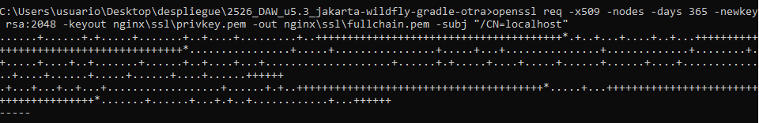

Compilación del WAR
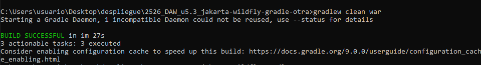

Preparación del directorio de despliegue
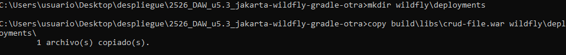

Levantar los servicios con docker-compose
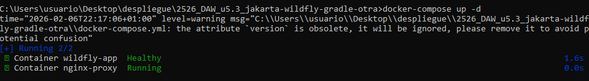

Estado de los contenedores
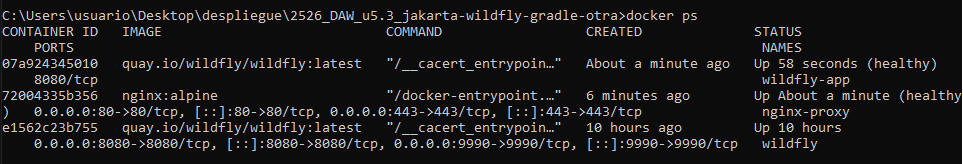

Logs y prueba HTTPS
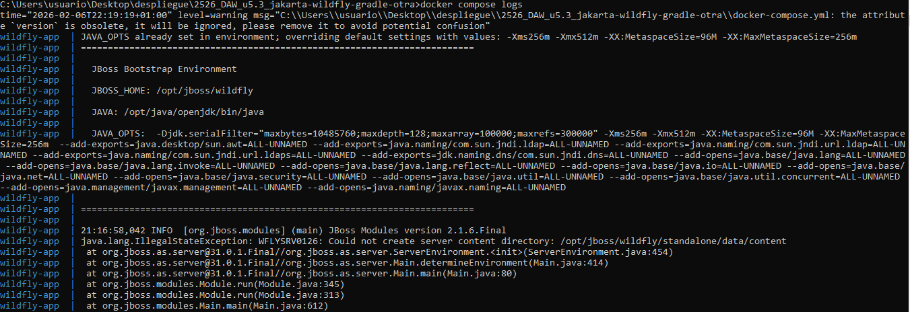

Verificación de healthchecks
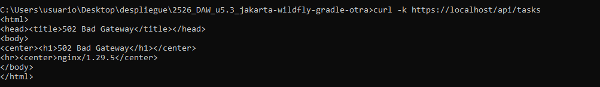